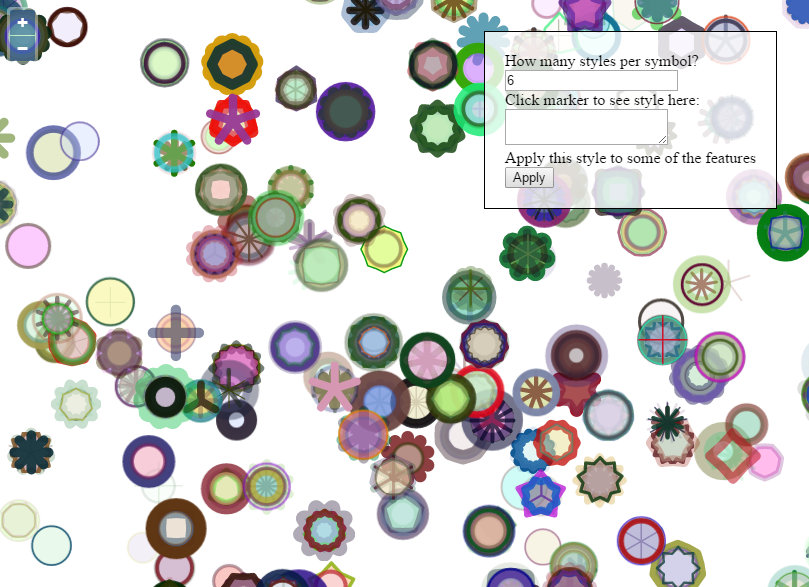
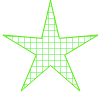
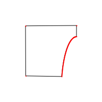
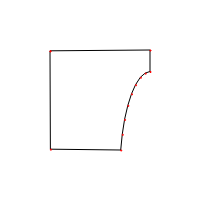

# OpenLayers Playground

This is Proof of Concept code for learning
aspects of OpenLayers and related spatial libraries

## All Examples

* [index (v4.6.5)](https://rawgit.com/ca0v/ol3-lab/v4.6.5/rawgit.html?run=ol3-lab/labs/index)
* [index (master)](https://rawgit.com/ca0v/ol3-lab/master/rawgit.html?run=ol3-lab/labs/index)

## Build using tsd, bower, tsc:

* tsd install
* bower install
* tsc -w

## Style Lab



```
[{
    "star": {
        "fill": {
            "pattern": {
                "orientation": "cross",
                "color": "rgba(81,237,59,0.5)",
                "spacing": 2,
                "repitition": "repeat"
            }
        },
        "opacity": 1,
        "stroke": {
            "color": "rgba(81,237,5,1)",
            "width": 0
        },
        "radius": 50,
        "radius2": 15,
        "points": 5,
        "angle": 0,
        "rotation": 0
    }
}]
```


```
[{
    "star": {
        "fill": {
            "color": "rgba(254,246,223,0.8)"
        },
        "opacity": 1,
        "stroke": {
            "color": "rgba(5,45,5,0.2)",
            "width": 1
        },
        "radius": 18,
        "radius2": 3,
        "points": 12,
        "angle": 0,
        "rotation": 0
    }
}]
```


```
[{
    "circle": {
        "fill": {
            "gradient": {
                "type": "radial(20,20,10,20,20,0)",
                "stops": "rgba(255,0,0,0) 0%;rgba(255,0,0,0.1) 10%;rgba(255,0,0,0.2) 20%;rgba(255,0,0,0.3) 40%;rgba(255,0,0,0.6) 100%"
            }
        },
        "opacity": 1,
        "stroke": {
            "color": "rgba(255,255,255,0.1)",
            "width": 1
        },
        "radius": 20,
        "rotation": 0
    }
}]
```

## Polyline Encoder

 

```
t`syzE}gm_dAm_@A?r@p@Bp@Hp@Ph@Td@Z`@`@Vb@Nd@xUABmF
```
