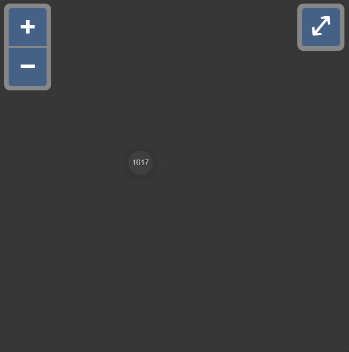

PRELIMINARY RESULTS
* Missing animation 
* Missing proper styling
* Center-of-mass calculations are wrong

## Problem
Rendering a large number of feature is impractical.  A a system is needed for determining when to fetch "count" and when to fetch the actual features.  A clustering strategy for determining when to render an approximation of the features and when to render the actual features is needed.

## Cient Side Solutions
Existing client-side clustering strategies rely on having the underlying geometry and testing for proximity, basically buffering around a feature, testing for any unclustered neighbors and putting them all in the same cluster.  This strategy only works when all the features are loaded in the current viewport.

From the Openlayers cluster source:

    cluster() {
        for (i = 0, ii = features.length; i < ii; i++) {
        feature = features[i];
        if (!(getUid(feature) in clustered)) {
            geometry = this.geometryFunction(feature);
            coordinates = geometry.getCoordinates();
            createOrUpdateFromCoordinate(coordinates, extent);
            buffer(extent, mapDistance, extent);

            neighbors = this.source.get(extent);
            neighbors = neighbors.filter(function (neighbor) {
                uid = getUid(neighbor);
                if (!(uid in clustered)) {
                    clustered[uid] = true;
                    return true;
                } else {
                    return false;
                }
            });
            this.features.push(this.createCluster(neighbors));
        }}
    }

The [AnimatedCluster](https://github.com/Viglino/ol-ext/blob/master/src/layer/AnimatedCluster.js) and [SelectCluster](https://github.com/Viglino/ol-ext/blob/master/src/interaction/SelectCluster.js) work ingeniously together to provide a responsive animation in this [animated cluster demo](http://viglino.github.io/ol-ext/examples/animation/map.animatedcluster.html) from Jean-Marc Viglino.

## Server Side Solutions
These would have access to the features and send approximations to the client.  Some examples:
* Vector Tiles, geometries are styled and simplified bases on zoom level
* https://github.com/cjstehno/coffeaelectronica/wiki/Mapping-Large-Data-Sets

## Expectation
We do not want to retrieve too many features too soon.  A solution should optimize server communication and screen real-estate to present the user with as much detail as possible without overwhelming the UI.  Although a server-side solution might be optimal and Vector Tiles are ideal, I think with a "count" query I can get similar functionality, if not performance, with a client-side only solution that works with older ArcGIS and OGC systems that can return a "count" or "hits" result.

## Meeting the Expectation
Here I will outline a "density" strategy that give "mass" and "volume" to "tiles" and individual "features".  Tile density is really just a way of ensuring we do not consume too few pixels when representing the data associate with a tile.  Put the features aside for the time being and consider only "count" data, or the number of features with centroid within the bounds of a tile.  Since we have the "count" of a tile, We can now consider a tiles mass to be the count and the tiles volume to be the area (with thickness 1).  With that we have a way to compute tile density.

## Definitions
| Term | Definition |
|:-|:-|
|tile|a MxN grid item|
|tile size|generally 256 x 256, the width and height of a single map tile|
|tile mass|the number of features within the bounds of that tile|
|tile volume|the number of pixels a tile represents|
|tile density|tile mass divided by tile volume|
|feature|data represented by a point, line or polygon marker|
|cluster marker|a point representing one or more features|
|density threshold|a scalar value that, once exceeded, indicates clustering is required|

## Computing Cluster Threshold
There needs to be a criteria for deciding if a feature should render.  We need some threshold value that, when crossed, renders the features as a cluster marker. One value that is easy to compute is the Z value of a feature or tile.  For a tile the Z value is just that -- the Z in the XYZ location.  For a feature the Z value must be computed.  This is done using the features bounding box.

The cluster marker representing a tile is stamped with the Z value of the tile they represent.

Now it is easy to decide if a feature should be rendered by comparing its Z value to the current zoom level.  If beyond threshold do not render it.

Cluster markers will have a tight range as there is no advantage to displaying a parent tile along side its child tiles.

Feature markers will have more leaway as it makes a lot of sense for the same feature to be visible over multiple zoom levels.

### Rule 1
Render tiles where -2 <= current level - Z <= -2 to ensure an adaquately large marker can represent the cluster area.  I use 2 assuming a square tile size of 256 as this leaves 64 x 64 pixels for the marker.

### Rule 2
Render features where -3 <= current level - Z <= 3 to ensure a single feature is visible across 7 zoom levels.  This assumes a 2D feature will fill at most 1024 x 1024 pixels but no more than 32 x 32 pixels.

## Computing Cluster Position

To render clusters nearest to location they represent, several values must be known:
1. `c`: the center of the tile
1. `m`: the total mass of the tile
1. `vm`: the mass of the visible features within the tile
1. `dm`: the mass of the non-visible features within the tile
1. `pm`: the phantom mass of the tile

The center of a tile is easily computed.
The total mass is either assigned via a count-query response or undefined.
The mass of a feature is 1.
The phantom mass is unaccounted for mass computed as `m - vm - dm`. 

It is not enough to know the mass but also the location of that mass:
@m: the center of m
@vm: the center of vm
@dm: the center of dm
@pm: the center of pm

A cluster only represents dark mass because visual mass represents itself.

The center of mass of a cluster is the `center-of-mass(@dm+@pm)`, which is the `center-of-mass(@m-@vm)`.  The later can only be computed when `m` is defined and the former reduces to `center-of-mass(@dm)` when `m` is undefined.

### Rule 3
The @vm of a tile is equal to the sum of the @vm of its children plus the @vm of any visible features bound by only that tile.

The @dm of a tile is equal to the sum of the @dm of its children plus the @dm of any hidden features bound by only that tile.

The @pm of a tile is equal to the @m of a tile minus all @dm and @vm and represents mass of features that are bound by only that tile but still unknown to that tile.

### Threshold
The Threshold should be externally configurable via `ClusterDensityThreshold` but should default to a value that ensures a reasonably styled cluster marker will remain within the tile it represents.  Assuming a square tile, `T` if size `w²` pixels at zoom level `Z`, it will have an area of `w²4(z-Z)`, where `z` represent the current zoom level.  As the user zooms out from `Z` the tile `T` gets smaller because z-Z gets smaller.  The smaller `T` gets the more dense it becomes.  At some point it should disappear, yielding to its parent to render instead.  This threshold value should default to about 2πr², which is `2π(A+B√count)²`.  

If the `w²4(z-Z)` exceeds `2π(A+B√count)²` then the tile is too dense to render.

## Areas of Concern
My solution for computing `cluster density` seems like it would be simpler if each cluster marker had a physical geometry (e.g. circle or polygon) associated with it.  In that case zooming in/out would have a visual effect on the markers.  When they get too large we render the children instead.  I feel that is a better option and may lend itself to using a built-in client-side clustering strategy.  Keep in mind current `count` results can count the same feature multiple times so it is still benificial to maintain the parent count data, complicating a built-in solution.

## Notes of Interest

### Computing Tile Identifier from an Extent
It was challenging to compute the tile identifiers given an extent due to floating point issues.  This solution got my tests to pass. The code below was a less-obvious solution for computing x and y but increased precision to acceptable levels:

    Z = pow(2, round(log2(root.w / node.w)))
    X = round(Z * (node.xmin - root.xmin)) / root.w)
    Y = round(Z * (node.ymin - root.ymin)) / root.h)

### Client-Side Caching of Aggregation Data
There are `stringify` and `unstringify` methods on the TileTree that may be used to cache the tree on the browser between sessions.  Since this tree is relatively expensive to build due to all the "count" or "hit" queries it will improve performance at the cost of a modest amount of client-side storage. 

There is a security risk in exposing aggregate feature counts, but defaulting to cache seems reasonable.  Use `DisableClusterCaching` to turn this feature off. 

There is risk of stale data but since the data grows more accurate as the user exercises the map (only leaf tiles need "count" data so zooming beyond current leaves will auto-refresh the data) it should be self-correcting without explicitly expiring the cache. The trick here is to only cache the leaf nodes and work backwards to rebuild the tree.  To that end, custom encoder/decoders should be used for processing the tree serializer, some for readability, some for terseness.  By default, use `TerseClusterEncoding`.

LINKS
* [this document](https://github.com/ca0v/ol3-lab/blob/v6.4.3/poc/README.md)